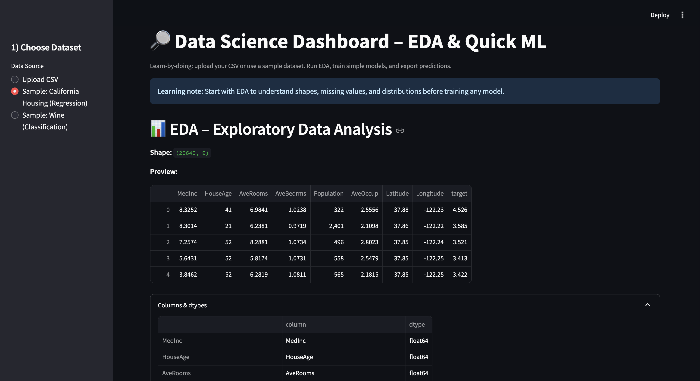
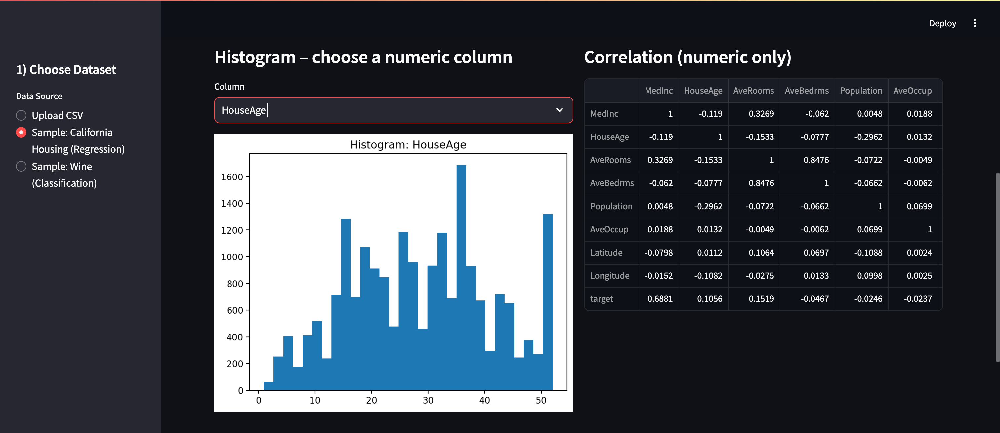
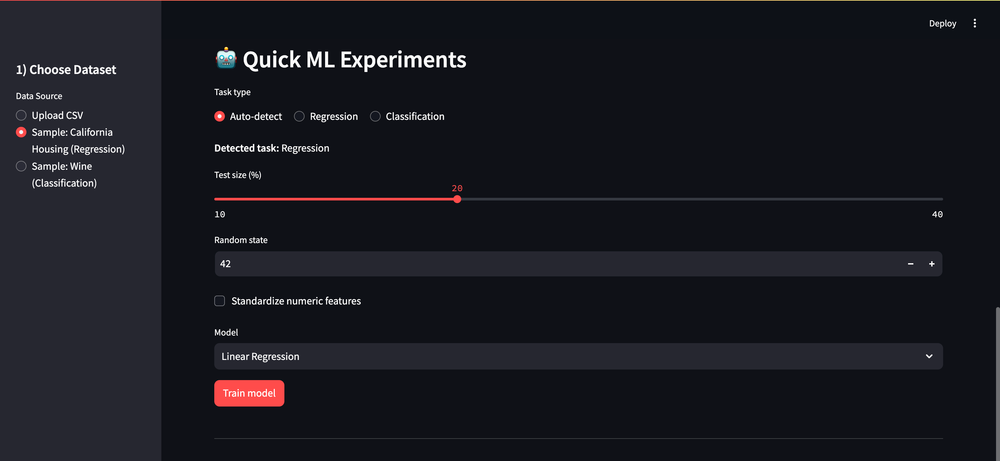
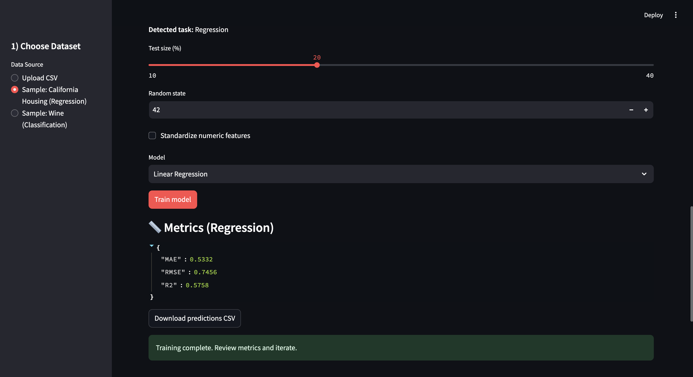
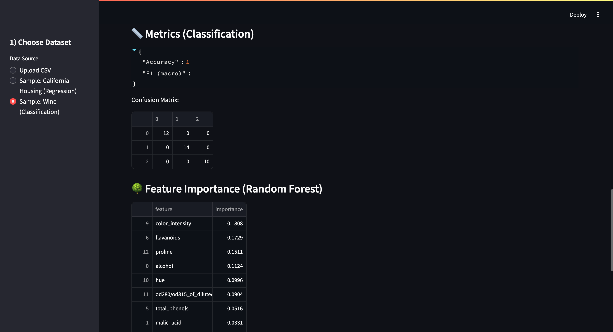
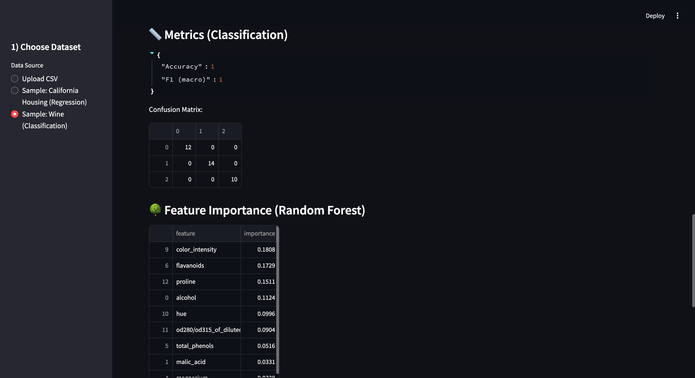
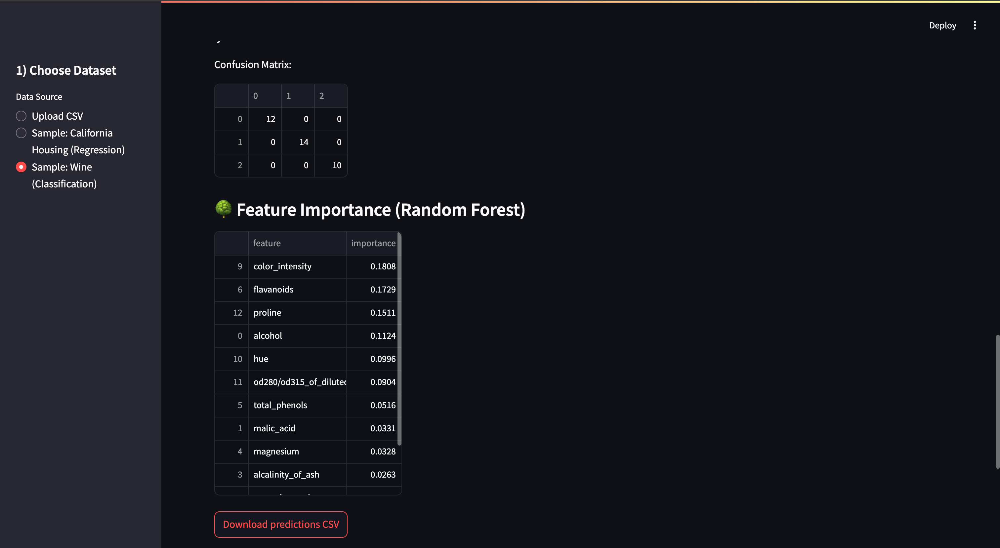

# Data Science Dashboard (Streamlit)


Interactive dashboard for EDA and quick ML experiments (regression/classification).


## Features
- CSV upload or built-in sample datasets (California Housing, Wine)
- EDA: summary, nulls, dtypes, histograms, correlations
- ML: Linear/Logistic Regression, Random Forest
- Metrics: MAE, RMSE, R² / Accuracy, F1, Confusion Matrix
- Export predictions as CSV

## Screenshots

### 1) Overview & dataset selection


### 2) EDA – Histograms & Correlations

### 3) ML Configuration & Metrics




### 4) Feature importance & export



## How to Run
```bash
pip install -r requirements.txt
streamlit run app.py

